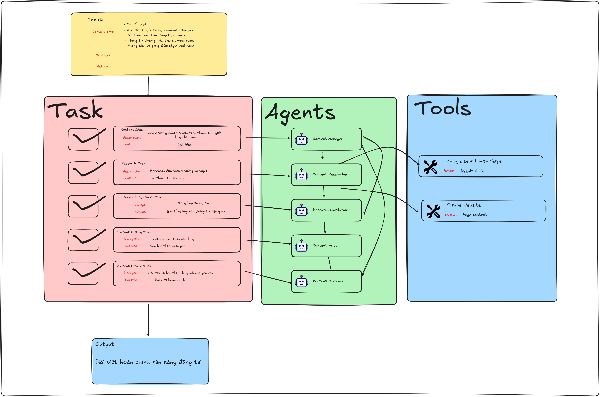
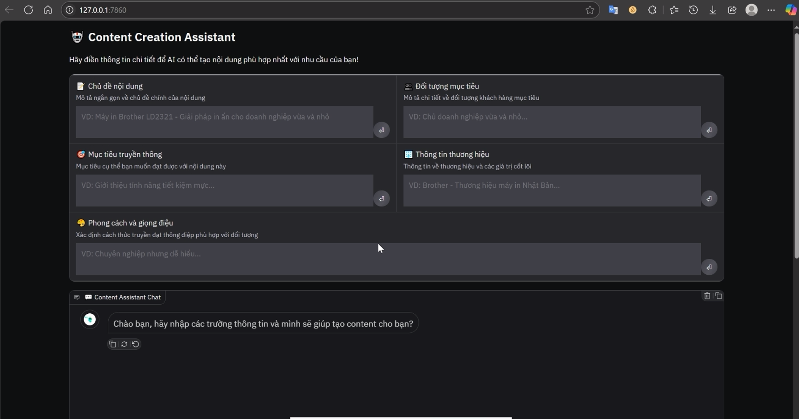
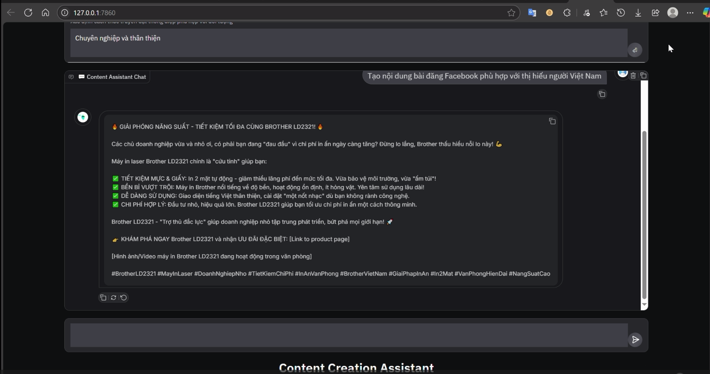
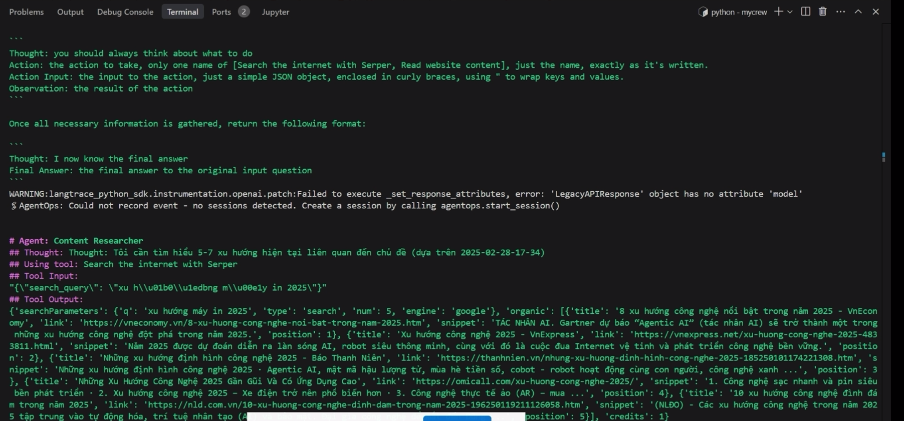
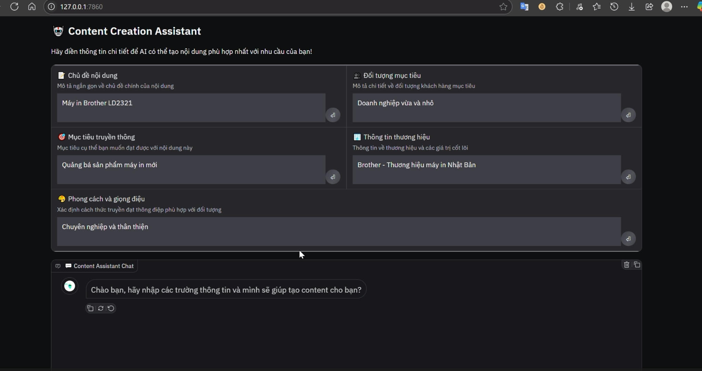

---

# AutoContent Generator với CrewAI

**Mô tả ngắn gọn**: Hệ thống tạo nội dung tự động sử dụng framework CrewAI, kết hợp các tác nhân AI để tự động hóa quy trình từ phát triển ý tưởng đến hoàn thiện bài viết.

---

## Minh họa kiến trúc



---

## Minh họa ứng dụng







---

## Video demo

[Xem video demo trên Google Drive](https://drive.google.com/file/d/1gfTxkdSJiWa29oT01KcTto_fkPyfd34k/view?usp=sharing)
[Xem video demo trên Google Drive](https://drive.google.com/file/d/1sQVNJt75jcMPdGDgVtaRuMb9tT-CsKIA/view?usp=sharing)


---

## Công nghệ sử dụng

- **Framework**: CrewAI
- **Công cụ**:
  - Google Search with Serper: Tìm kiếm và thu thập dữ liệu từ web.
  - Scrape Website: Trích xuất nội dung từ các trang web cụ thể.
- **Các Agents**:
  - Content Manager: Quản lý ý tưởng nội dung.
  - Content Researcher: Nghiên cứu và thu thập dữ liệu.
  - Research Synthesizer: Tổng hợp báo cáo từ dữ liệu nghiên cứu.
  - Content Writer: Viết bài dựa trên thông tin đầu vào.
  - Content Reviewer: Kiểm tra và hoàn thiện bài viết.
- **APP**: Gradio
---
## Hướng phát triển trong tương lai
Tích hợp thêm các tools khác..

### Bổ sung nhiều agent cho các tác vụ phức tạp hơn
Dưới đây là phần bổ sung ngắn gọn cho hướng dẫn cài đặt và chạy file `gr_app.py` trong README.md, dựa trên việc sử dụng file `requirements.txt`. Tôi sẽ trình bày rõ ràng và súc tích để phù hợp với một README ngắn gọn.

---

## Cài đặt và chạy

### Yêu cầu phần mềm
- Python 3.8 hoặc cao hơn.
- Các thư viện được liệt kê trong `requirements.txt`.

### Hướng dẫn cài đặt
1. Clone repository:
   ```
   git clone https://github.com/hainqh2506/content_crew.git
   cd content_crew
   ```
2. Cài đặt các thư viện từ `requirements.txt`:
   ```
   pip install -r requirements.txt
   ```
3. Cấu hình API key (nếu cần):
   - Tạo file `.env` trong thư mục gốc và thêm:
     ```
     OPENAI_API_KEY=your_key_here
     ```

### Chạy file `gr_app.py`
Khởi động ứng dụng bằng lệnh:
```
python gr_app.py 
```

---
